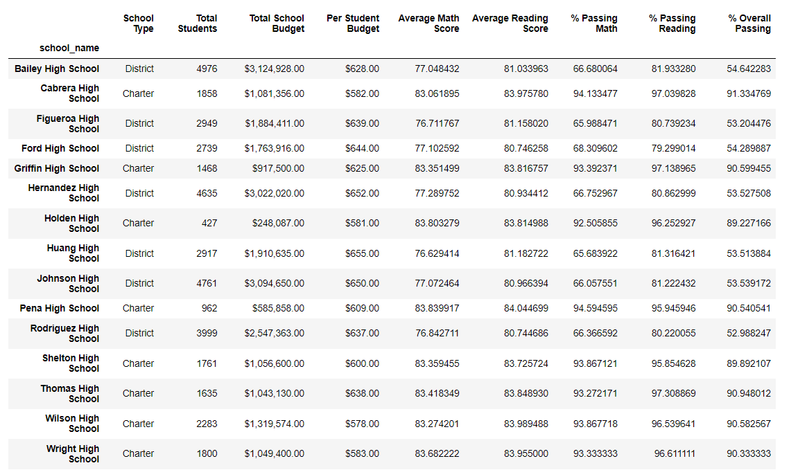

# School_District_Analysis
The original project consisted of analyzing data from two datafiles containing school and student details and deliver the following:
* A high-level snapshot of the district's key metrics, presented in a table format
* An overview of the key metrics for each school, presented in a table format
* Tables presenting each of the following metrics:
    1. Top 5 and bottom 5 performing schools, based on the overall passing rate
    2. The average math score received by students in each grade level at each school
    3. The average reading score received by students in each grade level at each school
    4. School performance based on the budget per student
    5. School performance based on the school size 
    6. School performance based on the type of school

After completing the analysis, the reliability of ninth grade reading and math scores of students from Thomas High School came under question. To ensure credibility the entire analysis was repeated after discarding the questionable data for ninth grade student grades for Thomas High School. There were a total of 461 students in 9th grade of Thomas School (out of a total population of 39170) whose score was discounted. This affected less than 2% (~1.18%) of data points. 
The following reports a comparison between the calculated metrics with original dataset and modified data without the questionable.
### Deliverable 1: A high-level snapshot of the district's key metrics (same for both stages of analysis)
	
### Deliverable 2: An overview of the key metrics for each school (same for both stages of analysis)
The following table provides the individual data points in student data.

Student data is summarized into key metrics for each shool in the following table:

### Deliverable 3:
Top 5 and bottom 5 schools with original dataset and modified dataset for comparison:\n
#### Original Data Top 5 Schools:

#### Modified Data Top 5 Schools:

It is clear form the two tables that the order of top schools remain unchanged after modification. Although the specific metrics (reading and math passing average and percentage) had small changes.
Bottom 5 school lists remain unchanged after data modification as is clear from the following two tables.
#### Original Data Bottom 5 Sccools:

#### Modified Data Bottom 5 Schools:

#### Average Math Scores received by students in each grade at each school (Original Dataset) and (Modifified Dataset)
Modified data lists NaN for ninth grade average in Thomas High School as the scores were discounted.
&emsp;&emsp;&emsp;&emsp;
#### Average Reading Scores received by students in each grade at each school (Original Dataset) and (Modifified Dataset)
Modified data lists NaN for ninth grade average in Thomas High School as the scores were discounted.
&emsp;&emsp;&emsp;&emsp; 
#### School Performance based on the Budget per Student:
The tables show there is no impact of modifying data on performance by budget per student. 
Original Dataset:
 
Modified Dataset:

#### School Performance based on School Size:
The tables show no impact of modifying data for performance depending on school size. 
Original Dataset:
 
Modified Dataset:

#### School Performance based on School Type:
The tables show no impact of modifying data for performance depending on school type. 
Original Dataset:
 
Modified Dataset:

